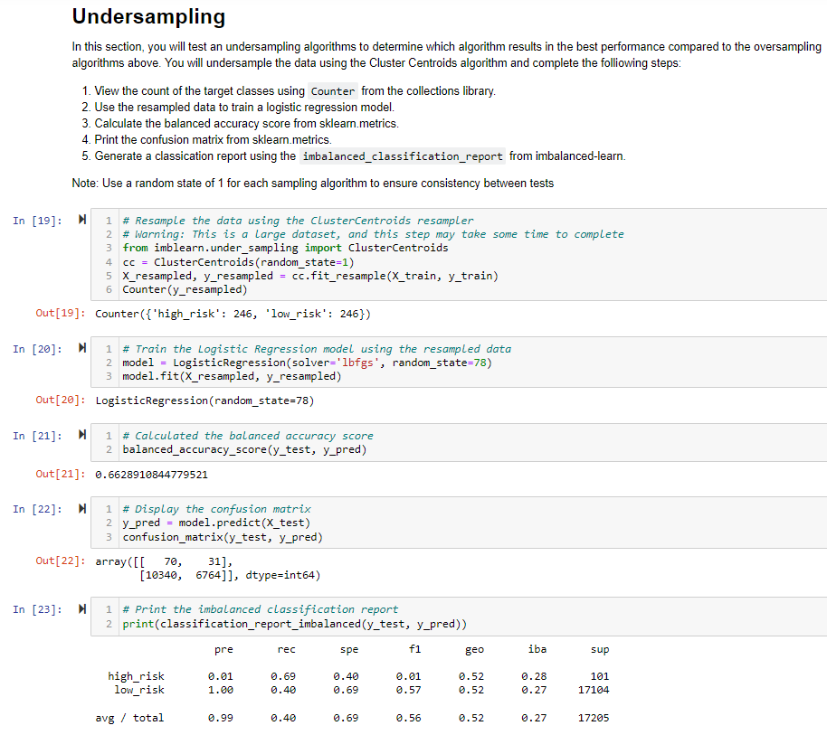

# Credit_Risk_Analysis
Predict Credit card risk for LendingClub, a peer-to-peer lending services company, using machine learning models.

## Overview of the loan prediction risk analysis:
The purpose of this project is to build machine learning models and determine if any of these models can be used to predict high credit risk. 

Credit risk is an inherently unbalanced classification problem, as good loans easily outnumber risky loans. Using the credit card credit dataset from LendingClub, I’ll oversample the data using the RandomOverSampler and SMOTE algorithms, and undersample the data using the ClusterCentroids algorithm. Then, I’ll use a combinatorial approach of over- and undersampling using the SMOTEENN algorithm. Next, I’ll compare two new machine learning models that reduce bias, BalancedRandomForestClassifier and EasyEnsembleClassifier, to predict credit risk.

- Deliverable 1: Use Resampling Models to Predict Credit Risk
- Deliverable 2: Use the SMOTEENN Algorithm to Predict Credit Risk
- Deliverable 3: Use Ensemble Classifiers to Predict Credit Risk

## Results:
### Deliverable 1: Use Resampling Models to Predict Credit Risk
- ***Naive Random Oversampling:***

- ***SMOTE Oversampling:***

- ***Cluster Centroid Undersampling:***

### Deliverable 2: Use the SMOTEENN Algorithm to Predict Credit Risk
- ***SMOTEENN Combination Sampling:***

### Deliverable 3: Use Ensemble Classifiers to Predict Credit Risk
- ***Balanced Random Forest Classifier:***

- ***Easy Ensemble AdaBoost Classifier:***

## Summary:

Below is the summary of the scores for all the six machine learning models used on the loan data for credit risk. 

Out of the six models, the first four models are not as effective as the accuracy score is not as high in comparison to the two Ensemble classifier models. Moreover, for a lending company, high sensitivity/recall score is important as they would not want to lend to HIGH risk customers. As you can see in the above the SMOTEENN Combination Sampling model and Easy Ensemble AdaBoost Classifier model have higher sensitivity scores. 

To conclude, I recommend using Easy Ensemble AdaBoost Classifier model to predict High credit Risk as it has highest sensitivity and accuracy scores. 

## Resources:
Data source: 
- [LoanStats_2019Q1.csv](Resources/LoanStats_2019Q1.csv)

Software:
- Python
- Jupyter Notebook
- Pandas, NumPy, Pathlib, Collections, Scikit-Learn, Imbalanced-Learn libraries
